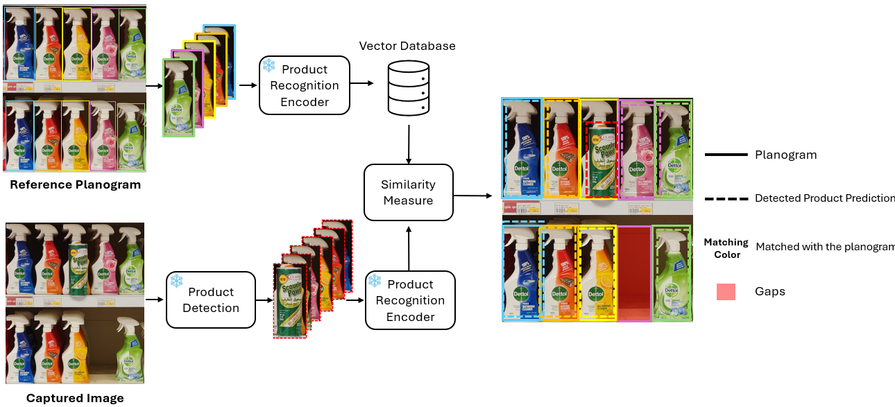

<p align="center">
   <br>
</p>


## RetailEye<br><sub>Supervised Contrastive Learning with Compliance Matching for Retail Shelf Monitoring</sub>

<div align="center">
   <br>
  <hr style="width:50%;border:1px solid #ccc;"> <br>
  
</div>

>[Supervised Contrastive Learning with Compliance Matching for Retail Shelf Monitoring](https://doi.org/10.1007/978-981-96-7036-9_17)<br>
>[Khaled Almutairy](https://www.linkedin.com/in/khaledalmutairy)<sup>1</sup>, [Mamoun Alghaslan](https://www.linkedin.com/in/mamoun-alghaslan-96207188/)<sup>1</sup>, [El-Sayed M. El-Alfy](https://scholar.google.com/citations?hl=en&user=2a51Yt8AAAAJ&view_op=list_works&sortby=pubdate)<sup>1,2, 3</sup> [Abdul-Jabbar Siddiqui](https://scholar.google.com/citations?user=uGRWGTwAAAAJ&hl=en)<sup>2, 3, 4</sup><br>
<sup>1</sup>Information and Computer Science, King Fahd University of Petroleum and Minerals, Saudi Arabia   
<sup>2</sup>Computer Engineering Department   
<sup>3</sup>Interdisciplinary Research Center of Intelligent Secure Systems   
<sup>4</sup>SDAIA-KFUPM Joint Research Center for Artificial Intelligence


<details>
  <summary>
  <font size="+1">Abstract</font>
  </summary>
By harnessing technological advancements in computer vision and artificial intelligence, retail entrepreneurs can not only meet their objectives but also position themselves for sustainable growth in a competitive marketplace. A critical area of focus is inventory management, particularly the monitoring of grocery products on shelves and the identification of misplaced or out-of-stock items. However, automatically detecting and recognizing products in real-time retail environments presents significant challenges, including several challenging factors such as varied visual representations, unpredictable poses, partial or full occlusions, and variations of lighting reflections on glossy packaging, and a lack of unified resources. In this paper, we propose and evaluate a two-stage approach, termed RetailEye, which employs supervised contrastive learning with compliance matching and leverages the latest developments in deep learning. After evaluating different models for object detection and recognition, we designed our system based on YOLOv8s in the first stage and EfficientNetV2-S and ResNet18 in the second stage. The proposed model outperformed the one-stage approach with high detection and recognition accuracies. Additionally, we unveil a custom dataset specifically curated for this research, aimed at advancing the field of inventory management.
</details>

<br>

## Installation

### Clone the repository
```
git clone https://github.com/KhaledSaud70/shelf-monitoring.git
cd shelf-monitoring/src
```

### Install dependencies
```
pip install -r requirements.txt
```

## Dataset Preparation
1. Download the SHAPE dataset from [FigShare](https://figshare.com/articles/dataset/SHAPE_-_SHelf_mAnagement_Product_datasEt/24100704).
3. Ensure the dataset structure matches the configuration in the YAML files.

## Training
To train the model, use the `launcher.py` script with the `train.yaml` configuration:

```bash
python launcher.py configs/train.yaml [optional_overrides]
```

Key training configuration options:
- `backbone`: Model backbone (default: timm-mobilenetv3_large_100.ra_in1k)
- `dataset`: Dataset to use (default: shape)
- `batch_size`: Training batch size (default: 64)
- `epochs`: Number of training epochs (default: 30)
- `lr`: Learning rate (default: 0.001)
- `output_dir`: Directory to save trained weights (default: ./weights)

Example with custom learning rate:
```bash
python launcher.py configs/train.yaml lr=0.0005
```

## Acknowledgments

This work builds upon the following excellent repository:
- [Unbiased Supervised Contrastive Learning](https://github.com/EIDOSLAB/unbiased-contrastive-learning)
